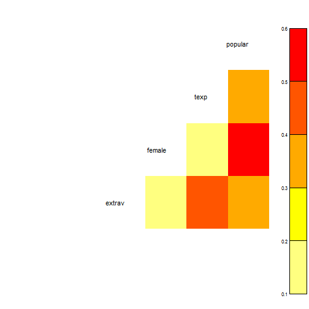

# MPlus Brownbag Multilevel Modeling Tutorial

## Data:


```r
load("~/RStudioProjects/MplusTutorials/MplusMultilevel/data/pop2.Rdata")
library(psych)
library(xtable)
library(arm)
library(car)
library(texreg)
library(GGally)
```

```
Warning: replacing previous import 'rename' when loading 'reshape'
```

```
Warning: replacing previous import 'round_any' when loading 'reshape'
```

```r
str(pop2, give.attr = FALSE)
```

```
'data.frame':	2000 obs. of  15 variables:
 $ pupil    : num  1 2 3 4 5 6 7 8 9 10 ...
 $ class    : num  1 1 1 1 1 1 1 1 1 1 ...
 $ extrav   : atomic  5 7 4 3 5 4 5 4 5 5 ...
 $ sex      : atomic  1 0 1 1 1 0 0 0 0 0 ...
 $ texp     : atomic  24 24 24 24 24 24 24 24 24 24 ...
 $ popular  : atomic  6.3 4.9 5.3 4.7 6 4.7 5.9 4.2 5.2 3.9 ...
 $ popteach : atomic  6 5 6 5 6 5 5 5 5 3 ...
 $ Zextrav  : num  -0.17 1.414 -0.962 -1.755 -0.17 ...
 $ Zsex     : num  0.989 -1.011 0.989 0.989 0.989 ...
 $ Ztexp    : num  1.49 1.49 1.49 1.49 1.49 ...
 $ Zpopular : num  0.885 -0.128 0.162 -0.272 0.668 ...
 $ Zpopteach: num  0.6691 -0.0431 0.6691 -0.0431 0.6691 ...
 $ Cextrav  : num  -0.215 1.785 -1.215 -2.215 -0.215 ...
 $ Ctexp    : num  9.74 9.74 9.74 9.74 9.74 ...
 $ Csex     : num  0.5 -0.5 0.5 0.5 0.5 -0.5 -0.5 -0.5 -0.5 -0.5 ...
```


```r

print(xtable(describe(pop2[, 1:6], interp = F, skew = F)), type = "html")
```

<!-- html table generated in R 2.15.3 by xtable 1.7-0 package -->
<!-- Sat Mar 30 07:21:09 2013 -->
<TABLE border=1>
<TR> <TH>  </TH> <TH> var </TH> <TH> n </TH> <TH> mean </TH> <TH> sd </TH> <TH> median </TH> <TH> trimmed </TH> <TH> mad </TH> <TH> min </TH> <TH> max </TH> <TH> range </TH> <TH> se </TH>  </TR>
  <TR> <TD align="right"> pupil </TD> <TD align="right">   1 </TD> <TD align="right"> 2000.00 </TD> <TD align="right"> 10.65 </TD> <TD align="right"> 5.97 </TD> <TD align="right"> 11.00 </TD> <TD align="right"> 10.56 </TD> <TD align="right"> 7.41 </TD> <TD align="right"> 1.00 </TD> <TD align="right"> 26.00 </TD> <TD align="right"> 25.00 </TD> <TD align="right"> 0.13 </TD> </TR>
  <TR> <TD align="right"> class </TD> <TD align="right">   2 </TD> <TD align="right"> 2000.00 </TD> <TD align="right"> 50.37 </TD> <TD align="right"> 29.08 </TD> <TD align="right"> 51.00 </TD> <TD align="right"> 50.33 </TD> <TD align="right"> 37.81 </TD> <TD align="right"> 1.00 </TD> <TD align="right"> 100.00 </TD> <TD align="right"> 99.00 </TD> <TD align="right"> 0.65 </TD> </TR>
  <TR> <TD align="right"> extrav </TD> <TD align="right">   3 </TD> <TD align="right"> 2000.00 </TD> <TD align="right"> 5.21 </TD> <TD align="right"> 1.26 </TD> <TD align="right"> 5.00 </TD> <TD align="right"> 5.17 </TD> <TD align="right"> 1.48 </TD> <TD align="right"> 1.00 </TD> <TD align="right"> 10.00 </TD> <TD align="right"> 9.00 </TD> <TD align="right"> 0.03 </TD> </TR>
  <TR> <TD align="right"> sex </TD> <TD align="right">   4 </TD> <TD align="right"> 2000.00 </TD> <TD align="right"> 0.51 </TD> <TD align="right"> 0.50 </TD> <TD align="right"> 1.00 </TD> <TD align="right"> 0.51 </TD> <TD align="right"> 0.00 </TD> <TD align="right"> 0.00 </TD> <TD align="right"> 1.00 </TD> <TD align="right"> 1.00 </TD> <TD align="right"> 0.01 </TD> </TR>
  <TR> <TD align="right"> texp </TD> <TD align="right">   5 </TD> <TD align="right"> 2000.00 </TD> <TD align="right"> 14.26 </TD> <TD align="right"> 6.55 </TD> <TD align="right"> 15.00 </TD> <TD align="right"> 14.40 </TD> <TD align="right"> 8.15 </TD> <TD align="right"> 2.00 </TD> <TD align="right"> 25.00 </TD> <TD align="right"> 23.00 </TD> <TD align="right"> 0.15 </TD> </TR>
  <TR> <TD align="right"> popular </TD> <TD align="right">   6 </TD> <TD align="right"> 2000.00 </TD> <TD align="right"> 5.08 </TD> <TD align="right"> 1.38 </TD> <TD align="right"> 5.10 </TD> <TD align="right"> 5.08 </TD> <TD align="right"> 1.33 </TD> <TD align="right"> 0.00 </TD> <TD align="right"> 9.50 </TD> <TD align="right"> 9.50 </TD> <TD align="right"> 0.03 </TD> </TR>
   </TABLE>


## Change 'sex' to 'female' and add Unique ID variable 


```r
pop2$id <- (pop2$class * 100) + pop2$pupil
u.id <- unique(pop2$id)
names(pop2)[4] <- "female"
print(paste("# unique id variables =", length(u.id)))
```

```
[1] "# unique id variables = 2000"
```


```r

print(xtable(describe(pop2[, c(1:6, 16)], interp = F, skew = F)), type = "html")
```

<!-- html table generated in R 2.15.3 by xtable 1.7-0 package -->
<!-- Sat Mar 30 07:21:09 2013 -->
<TABLE border=1>
<TR> <TH>  </TH> <TH> var </TH> <TH> n </TH> <TH> mean </TH> <TH> sd </TH> <TH> median </TH> <TH> trimmed </TH> <TH> mad </TH> <TH> min </TH> <TH> max </TH> <TH> range </TH> <TH> se </TH>  </TR>
  <TR> <TD align="right"> pupil </TD> <TD align="right">   1 </TD> <TD align="right"> 2000.00 </TD> <TD align="right"> 10.65 </TD> <TD align="right"> 5.97 </TD> <TD align="right"> 11.00 </TD> <TD align="right"> 10.56 </TD> <TD align="right"> 7.41 </TD> <TD align="right"> 1.00 </TD> <TD align="right"> 26.00 </TD> <TD align="right"> 25.00 </TD> <TD align="right"> 0.13 </TD> </TR>
  <TR> <TD align="right"> class </TD> <TD align="right">   2 </TD> <TD align="right"> 2000.00 </TD> <TD align="right"> 50.37 </TD> <TD align="right"> 29.08 </TD> <TD align="right"> 51.00 </TD> <TD align="right"> 50.33 </TD> <TD align="right"> 37.81 </TD> <TD align="right"> 1.00 </TD> <TD align="right"> 100.00 </TD> <TD align="right"> 99.00 </TD> <TD align="right"> 0.65 </TD> </TR>
  <TR> <TD align="right"> extrav </TD> <TD align="right">   3 </TD> <TD align="right"> 2000.00 </TD> <TD align="right"> 5.21 </TD> <TD align="right"> 1.26 </TD> <TD align="right"> 5.00 </TD> <TD align="right"> 5.17 </TD> <TD align="right"> 1.48 </TD> <TD align="right"> 1.00 </TD> <TD align="right"> 10.00 </TD> <TD align="right"> 9.00 </TD> <TD align="right"> 0.03 </TD> </TR>
  <TR> <TD align="right"> female </TD> <TD align="right">   4 </TD> <TD align="right"> 2000.00 </TD> <TD align="right"> 0.51 </TD> <TD align="right"> 0.50 </TD> <TD align="right"> 1.00 </TD> <TD align="right"> 0.51 </TD> <TD align="right"> 0.00 </TD> <TD align="right"> 0.00 </TD> <TD align="right"> 1.00 </TD> <TD align="right"> 1.00 </TD> <TD align="right"> 0.01 </TD> </TR>
  <TR> <TD align="right"> texp </TD> <TD align="right">   5 </TD> <TD align="right"> 2000.00 </TD> <TD align="right"> 14.26 </TD> <TD align="right"> 6.55 </TD> <TD align="right"> 15.00 </TD> <TD align="right"> 14.40 </TD> <TD align="right"> 8.15 </TD> <TD align="right"> 2.00 </TD> <TD align="right"> 25.00 </TD> <TD align="right"> 23.00 </TD> <TD align="right"> 0.15 </TD> </TR>
  <TR> <TD align="right"> popular </TD> <TD align="right">   6 </TD> <TD align="right"> 2000.00 </TD> <TD align="right"> 5.08 </TD> <TD align="right"> 1.38 </TD> <TD align="right"> 5.10 </TD> <TD align="right"> 5.08 </TD> <TD align="right"> 1.33 </TD> <TD align="right"> 0.00 </TD> <TD align="right"> 9.50 </TD> <TD align="right"> 9.50 </TD> <TD align="right"> 0.03 </TD> </TR>
  <TR> <TD align="right"> id </TD> <TD align="right">   7 </TD> <TD align="right"> 2000.00 </TD> <TD align="right"> 5047.60 </TD> <TD align="right"> 2907.72 </TD> <TD align="right"> 5102.50 </TD> <TD align="right"> 5043.29 </TD> <TD align="right"> 3779.15 </TD> <TD align="right"> 101.00 </TD> <TD align="right"> 10020.00 </TD> <TD align="right"> 9919.00 </TD> <TD align="right"> 65.02 </TD> </TR>
   </TABLE>


```r
some(pop2[, c(2, 1, 16)], n = 20)
```

```
     class pupil    id
19       1    19   119
240     12    11  1211
386     19    16  1916
471     23    17  2317
550     27    14  2714
563     28     7  2807
571     28    15  2815
625     31    16  3116
703     35    10  3510
705     35    12  3512
720     36     7  3607
907     46     8  4608
1018    51    20  5120
1129    57     7  5707
1249    63    12  6312
1363    69     2  6902
1522    77     7  7707
1898    96     4  9604
1980    99    23  9923
1990   100    10 10010
```


## historgrams


```r
par(mfcol = c(2, 2))
hist(pop2$popular, col = "red", breaks = 10)
hist(pop2$female, col = "red", breaks = 2)
hist(pop2$extrav, col = "red", breaks = 10)
hist(pop2$texp, col = "red", breaks = 10)
```

 


## correlations


```r
# corrplot is found in the 'arm' package
corrplot(pop2[, 3:6], color = TRUE)
```

 


```r
ggpairs(pop2[, 3:6])
```

 


## Research Question:


Are extraverted students more popular than intraverted students?
<br />
<br />
<br />
<br />
<br />
<br />
<br />
<br />
<br />
<br />

One OLS regression, ignoring nesting within classes (n=2000):
$$
Y_{i}=\beta_{0} + \beta_{1} X_{1i} + \beta_{2} X_{2i} + e_{i}
$$
<br />
<br />
<br />
<br />
<br />
<br />
<br />
<br />
<br />
<br />
$$
popularity_{i}=\beta_{0} + \beta_{1} female_{1i} + \beta_{2} extraversion_{2i} + e_{i}
$$

<br />
<br />
<br />
<br />
<br />
<br />
<br />
<br />
<br />
<br />
OLS at class level (n=100):
$$
\bar{Y}_{j}=\beta_{0} + \beta_{1} \bar{X}_{1j} + \beta_{2} \bar{X}_{2j} + e_{j}
$$
<br />
<br />
<br />
<br />
<br />
$$
mean.popularity_{j}=\beta_{0} + \beta_{1} mean.female_{1j} + \beta_{2} mean.extraversion_{2j} + e_{j}
$$
<br />
<br />
<br />
<br />
<br />
<br />
<br />
<br />
<br />
<br />

separate OLS regression equation for each class:
$$
Y_{ij}=\beta_{0j} + \beta_{1j}X_{1ij} + \beta_{2j}X_{2ij} + e_{ij}
$$
<br />
<br />
<br />
<br />
<br />

$$
popularity_{ij}=\beta_{0j} + \beta_{1j}female_{1ij} + \beta_{2j}extraversion_{2ij} + e_{ij}
$$
<br />
<br />
<br />
<br />
<br />

```r

cp.mod <- lm(popular ~ female + extrav, pop2)

ag.pop2 <- aggregate(pop2, by = list(pop2$class), FUN = mean)
np1.mod <- lm(popular ~ female + extrav, ag.pop2)
np2.mod <- lm(popular ~ female + extrav + class, pop2)
ml.mod <- lmer(popular ~ female + extrav + (1 | class), pop2)
mod.names <- c("1 OLS", "100 OLS", "MLM")
htmlreg(list(cp.mod, np1.mod, np2.mod, ml.mod), omit.coef = "class")
```


<!DOCTYPE html>
<html>
  <head>
    <title></title>
    <style type="text/css">
      table {
        border: none;
      }
      th {
        text-align: left;
        border-top: 2px solid black;
        border-bottom: 1px solid black;
        padding-right: 12px;
      }
      .midRule {
        border-top: 1px solid black;
      }
      .bottomRule {
        border-bottom: 2px solid black;
      }
      td {
        padding-right: 12px;
        border: none;
      }
      caption span {
        float: left;
      }
      sup {
        vertical-align: 4px;
      }
    </style>
  </head>

  <body>
    <table cellspacing="0">
      <tr>
        <th class="modelnames"></th>
        <th><b>Model 1</b></th>
        <th><b>Model 2</b></th>
        <th><b>Model 3</b></th>
        <th><b>Model 4</b></th>
      </tr>
      <tr>
        <td>(Intercept)</td>
        <td>2.79<sup>***</sup></td>
        <td>4.18<sup>***</sup></td>
        <td>2.70<sup>***</sup></td>
        <td>2.14</td>
      </tr>
      <tr>
        <td></td>
        <td>(0.10)</td>
        <td>(0.52)</td>
        <td>(0.11)</td>
        <td>(0.12)</td>
      </tr>
      <tr>
        <td>female</td>
        <td>1.51<sup>***</sup></td>
        <td>2.93<sup>***</sup></td>
        <td>1.51<sup>***</sup></td>
        <td>1.25</td>
      </tr>
      <tr>
        <td></td>
        <td>(0.05)</td>
        <td>(0.33)</td>
        <td>(0.05)</td>
        <td>(0.04)</td>
      </tr>
      <tr>
        <td>extrav</td>
        <td>0.29<sup>***</sup></td>
        <td>-0.11</td>
        <td>0.29<sup>***</sup></td>
        <td>0.44</td>
      </tr>
      <tr>
        <td></td>
        <td>(0.02)</td>
        <td>(0.10)</td>
        <td>(0.02)</td>
        <td>(0.02)</td>
      </tr>
      <tr>
        <td class="midRule">R<sup>2</sup></td>
        <td class="midRule">0.39</td>
        <td class="midRule">0.44</td>
        <td class="midRule">0.40</td>
        <td class="midRule"></td>
      </tr>
      <tr>
        <td>Adj. R<sup>2</sup></td>
        <td>0.39</td>
        <td>0.43</td>
        <td>0.39</td>
        <td></td>
      </tr>
      <tr>
        <td>Num. obs.</td>
        <td>2000</td>
        <td>100</td>
        <td>2000</td>
        <td>2000</td>
      </tr>
      <tr>
        <td>AIC</td>
        <td></td>
        <td></td>
        <td></td>
        <td>4958.30</td>
      </tr>
      <tr>
        <td>BIC</td>
        <td></td>
        <td></td>
        <td></td>
        <td>4986.30</td>
      </tr>
      <tr>
        <td>Log Likelihood</td>
        <td></td>
        <td></td>
        <td></td>
        <td>-2474.15</td>
      </tr>
      <tr>
        <td>Deviance</td>
        <td></td>
        <td></td>
        <td></td>
        <td>4948.30</td>
      </tr>
      <tr>
        <td>Num. groups: class</td>
        <td></td>
        <td></td>
        <td></td>
        <td>100</td>
      </tr>
      <tr>
        <td>Variance: class.(Intercept)</td>
        <td></td>
        <td></td>
        <td></td>
        <td>0.63</td>
      </tr>
      <tr>
        <td class="bottomRule">Variance: Residual</td>
        <td class="bottomRule"></td>
        <td class="bottomRule"></td>
        <td class="bottomRule"></td>
        <td class="bottomRule">0.59</td>
      </tr>
      <tr>
        <td colspan="5"><span style="font-size:0.8em"><sup>***</sup>p &lt; 0.001, <sup>**</sup>p &lt; 0.01, <sup>*</sup>p &lt; 0.05, <sup>&middot;</sup>p &lt; 0.1</span></td>
      </tr>
     </table>
  </body>
</html>


Intercept only model:

level 1: 
$$
Y_{ij}=\beta_{0j}+e_{ij}
$$
<br />
<br />
<br />
<br />
<br />
<br />
<br />
<br />
<br />
<br />
level 2:
$$
\beta_{0j}=\gamma_{00}+u_{0j}
$$
<br />
<br />
<br />
<br />
<br />
<br />
<br />
<br />
<br />
<br />
Intraclass correlation (ICC):
$$ 
\rho =\frac{\sigma_{u_0}^2}{\sigma_{u_0}^2 + \sigma_{e}^2}
$$
<br />
<br />
<br />
<br />
<br />


```r
mod0 <- lmer(popular ~ 1 + (1 | class), pop2, REML = FALSE)
mod1 <- lmer(popular ~ female + extrav + (1 | class), pop2, REML = FALSE)
mod2 <- lmer(popular ~ female + extrav + texp + (1 + extrav | class), pop2, 
    REML = FALSE)
mod3 <- lmer(popular ~ female + extrav * texp + (1 + extrav | class), pop2, 
    REML = FALSE)
mod.names <- c("unconditional", "level 1", "level 2", "interaction")
htmlreg(list(mod0, mod1, mod2, mod3), model.names = mod.names, symbol = "+", 
    caption = "Multilevel Models", caption.above = TRUE)
```


<!DOCTYPE html>
<html>
  <head>
    <title>Multilevel Models</title>
    <style type="text/css">
      table {
        border: none;
      }
      th {
        text-align: left;
        border-top: 2px solid black;
        border-bottom: 1px solid black;
        padding-right: 12px;
      }
      .midRule {
        border-top: 1px solid black;
      }
      .bottomRule {
        border-bottom: 2px solid black;
      }
      td {
        padding-right: 12px;
        border: none;
      }
      caption span {
        float: left;
      }
      sup {
        vertical-align: 4px;
      }
    </style>
  </head>

  <body>
    <table cellspacing="0">
      <caption align="top" style="margin-bottom:0.3em">Multilevel Models</caption>
      <tr>
        <th class="modelnames"></th>
        <th><b>unconditional</b></th>
        <th><b>level 1</b></th>
        <th><b>level 2</b></th>
        <th><b>interaction</b></th>
      </tr>
      <tr>
        <td>(Intercept)</td>
        <td>5.08</td>
        <td>2.14</td>
        <td>0.74</td>
        <td>-1.21</td>
      </tr>
      <tr>
        <td></td>
        <td>(0.09)</td>
        <td>(0.12)</td>
        <td>(0.20)</td>
        <td>(0.27)</td>
      </tr>
      <tr>
        <td>female</td>
        <td></td>
        <td>1.25</td>
        <td>1.25</td>
        <td>1.24</td>
      </tr>
      <tr>
        <td></td>
        <td></td>
        <td>(0.04)</td>
        <td>(0.04)</td>
        <td>(0.04)</td>
      </tr>
      <tr>
        <td>extrav</td>
        <td></td>
        <td>0.44</td>
        <td>0.45</td>
        <td>0.80</td>
      </tr>
      <tr>
        <td></td>
        <td></td>
        <td>(0.02)</td>
        <td>(0.02)</td>
        <td>(0.04)</td>
      </tr>
      <tr>
        <td>texp</td>
        <td></td>
        <td></td>
        <td>0.09</td>
        <td>0.23</td>
      </tr>
      <tr>
        <td></td>
        <td></td>
        <td></td>
        <td>(0.01)</td>
        <td>(0.02)</td>
      </tr>
      <tr>
        <td>extrav:texp</td>
        <td></td>
        <td></td>
        <td></td>
        <td>-0.02</td>
      </tr>
      <tr>
        <td></td>
        <td></td>
        <td></td>
        <td></td>
        <td>(0.00)</td>
      </tr>
      <tr>
        <td class="midRule">AIC</td>
        <td class="midRule">6333.47</td>
        <td class="midRule">4943.95</td>
        <td class="midRule">4828.81</td>
        <td class="midRule">4765.62</td>
      </tr>
      <tr>
        <td>BIC</td>
        <td>6350.27</td>
        <td>4971.96</td>
        <td>4873.61</td>
        <td>4816.03</td>
      </tr>
      <tr>
        <td>Log Likelihood</td>
        <td>-3163.73</td>
        <td>-2466.98</td>
        <td>-2406.40</td>
        <td>-2373.81</td>
      </tr>
      <tr>
        <td>Deviance</td>
        <td>6327.47</td>
        <td>4933.95</td>
        <td>4812.81</td>
        <td>4747.62</td>
      </tr>
      <tr>
        <td>Num. obs.</td>
        <td>2000</td>
        <td>2000</td>
        <td>2000</td>
        <td>2000</td>
      </tr>
      <tr>
        <td>Num. groups: class</td>
        <td>100</td>
        <td>100</td>
        <td>100</td>
        <td>100</td>
      </tr>
      <tr>
        <td>Variance: class.(Intercept)</td>
        <td>0.69</td>
        <td>0.62</td>
        <td>1.28</td>
        <td>0.45</td>
      </tr>
      <tr>
        <td>Variance: Residual</td>
        <td>1.22</td>
        <td>0.59</td>
        <td>0.55</td>
        <td>0.55</td>
      </tr>
      <tr>
        <td class="bottomRule">Variance: class.extrav</td>
        <td class="bottomRule"></td>
        <td class="bottomRule"></td>
        <td class="bottomRule">0.03</td>
        <td class="bottomRule">0.00</td>
      </tr>
      <tr>
        <td colspan="5"><span style="font-size:0.8em"><sup>***</sup>p &lt; 0.001, <sup>**</sup>p &lt; 0.01, <sup>*</sup>p &lt; 0.05, <sup>+</sup>p &lt; 0.1</span></td>
      </tr>
     </table>
  </body>
</html>


## Preparing pop2 data for Mplus in R

```r
# The foreign package contains many functions to import various types of
# data from other stats programs.
library(foreign)
# use this command to read in an SPSS file:
popular2 <- read.spss(file = "data/popular2.sav", use.value.labels = FALSE, 
    to.data.frame = TRUE, use.missings = TRUE)
# The following command creates a .dat file and and .inp file with the
# basic Mplus code.
library(MplusAutomation)
prepareMplusData(df = popular2, filename = "data/popular2.dat", inpfile = "mplus/popular2.bare.inp")
```


