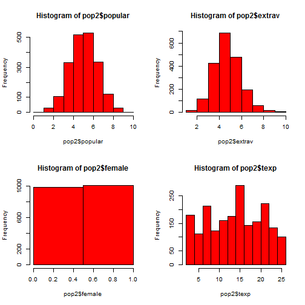

# MPlus Brownbag Multilevel Modeling Tutorial

## Data:


```r
load("~/RStudioProjects/MplusTutorials/MplusMultilevel/data/pop2.Rdata")
library(psych)
library(xtable)
library(arm)
library(car)
library(texreg)
library(mice)
str(pop2, give.attr = FALSE)
```

```
'data.frame':	2000 obs. of  15 variables:
 $ pupil    : num  1 2 3 4 5 6 7 8 9 10 ...
 $ class    : num  1 1 1 1 1 1 1 1 1 1 ...
 $ extrav   : atomic  5 7 4 3 5 4 5 4 5 5 ...
 $ sex      : atomic  1 0 1 1 1 0 0 0 0 0 ...
 $ texp     : atomic  24 24 24 24 24 24 24 24 24 24 ...
 $ popular  : atomic  6.3 4.9 5.3 4.7 6 4.7 5.9 4.2 5.2 3.9 ...
 $ popteach : atomic  6 5 6 5 6 5 5 5 5 3 ...
 $ Zextrav  : num  -0.17 1.414 -0.962 -1.755 -0.17 ...
 $ Zsex     : num  0.989 -1.011 0.989 0.989 0.989 ...
 $ Ztexp    : num  1.49 1.49 1.49 1.49 1.49 ...
 $ Zpopular : num  0.885 -0.128 0.162 -0.272 0.668 ...
 $ Zpopteach: num  0.6691 -0.0431 0.6691 -0.0431 0.6691 ...
 $ Cextrav  : num  -0.215 1.785 -1.215 -2.215 -0.215 ...
 $ Ctexp    : num  9.74 9.74 9.74 9.74 9.74 ...
 $ Csex     : num  0.5 -0.5 0.5 0.5 0.5 -0.5 -0.5 -0.5 -0.5 -0.5 ...
```


```r

print(xtable(describe(pop2[, 1:6], interp = F, skew = F)), type = "html")
```

<!-- html table generated in R 2.15.3 by xtable 1.7-0 package -->
<!-- Sat Mar 16 17:10:31 2013 -->
<TABLE border=1>
<TR> <TH>  </TH> <TH> var </TH> <TH> n </TH> <TH> mean </TH> <TH> sd </TH> <TH> median </TH> <TH> trimmed </TH> <TH> mad </TH> <TH> min </TH> <TH> max </TH> <TH> range </TH> <TH> se </TH>  </TR>
  <TR> <TD align="right"> pupil </TD> <TD align="right">   1 </TD> <TD align="right"> 2000.00 </TD> <TD align="right"> 10.65 </TD> <TD align="right"> 5.97 </TD> <TD align="right"> 11.00 </TD> <TD align="right"> 10.56 </TD> <TD align="right"> 7.41 </TD> <TD align="right"> 1.00 </TD> <TD align="right"> 26.00 </TD> <TD align="right"> 25.00 </TD> <TD align="right"> 0.13 </TD> </TR>
  <TR> <TD align="right"> class </TD> <TD align="right">   2 </TD> <TD align="right"> 2000.00 </TD> <TD align="right"> 50.37 </TD> <TD align="right"> 29.08 </TD> <TD align="right"> 51.00 </TD> <TD align="right"> 50.33 </TD> <TD align="right"> 37.81 </TD> <TD align="right"> 1.00 </TD> <TD align="right"> 100.00 </TD> <TD align="right"> 99.00 </TD> <TD align="right"> 0.65 </TD> </TR>
  <TR> <TD align="right"> extrav </TD> <TD align="right">   3 </TD> <TD align="right"> 2000.00 </TD> <TD align="right"> 5.21 </TD> <TD align="right"> 1.26 </TD> <TD align="right"> 5.00 </TD> <TD align="right"> 5.17 </TD> <TD align="right"> 1.48 </TD> <TD align="right"> 1.00 </TD> <TD align="right"> 10.00 </TD> <TD align="right"> 9.00 </TD> <TD align="right"> 0.03 </TD> </TR>
  <TR> <TD align="right"> sex </TD> <TD align="right">   4 </TD> <TD align="right"> 2000.00 </TD> <TD align="right"> 0.51 </TD> <TD align="right"> 0.50 </TD> <TD align="right"> 1.00 </TD> <TD align="right"> 0.51 </TD> <TD align="right"> 0.00 </TD> <TD align="right"> 0.00 </TD> <TD align="right"> 1.00 </TD> <TD align="right"> 1.00 </TD> <TD align="right"> 0.01 </TD> </TR>
  <TR> <TD align="right"> texp </TD> <TD align="right">   5 </TD> <TD align="right"> 2000.00 </TD> <TD align="right"> 14.26 </TD> <TD align="right"> 6.55 </TD> <TD align="right"> 15.00 </TD> <TD align="right"> 14.40 </TD> <TD align="right"> 8.15 </TD> <TD align="right"> 2.00 </TD> <TD align="right"> 25.00 </TD> <TD align="right"> 23.00 </TD> <TD align="right"> 0.15 </TD> </TR>
  <TR> <TD align="right"> popular </TD> <TD align="right">   6 </TD> <TD align="right"> 2000.00 </TD> <TD align="right"> 5.08 </TD> <TD align="right"> 1.38 </TD> <TD align="right"> 5.10 </TD> <TD align="right"> 5.08 </TD> <TD align="right"> 1.33 </TD> <TD align="right"> 0.00 </TD> <TD align="right"> 9.50 </TD> <TD align="right"> 9.50 </TD> <TD align="right"> 0.03 </TD> </TR>
   </TABLE>


## Add Unique ID variable


```r
pop2$id <- (pop2$class * 100) + pop2$pupil
u.id <- unique(pop2$id)
print(paste("# unique id variables =", length(u.id)))
```

```
[1] "# unique id variables = 2000"
```


```r

print(xtable(describe(pop2[, c(1:6, 16)], interp = F, skew = F)), type = "html")
```

<!-- html table generated in R 2.15.3 by xtable 1.7-0 package -->
<!-- Sat Mar 16 17:10:31 2013 -->
<TABLE border=1>
<TR> <TH>  </TH> <TH> var </TH> <TH> n </TH> <TH> mean </TH> <TH> sd </TH> <TH> median </TH> <TH> trimmed </TH> <TH> mad </TH> <TH> min </TH> <TH> max </TH> <TH> range </TH> <TH> se </TH>  </TR>
  <TR> <TD align="right"> pupil </TD> <TD align="right">   1 </TD> <TD align="right"> 2000.00 </TD> <TD align="right"> 10.65 </TD> <TD align="right"> 5.97 </TD> <TD align="right"> 11.00 </TD> <TD align="right"> 10.56 </TD> <TD align="right"> 7.41 </TD> <TD align="right"> 1.00 </TD> <TD align="right"> 26.00 </TD> <TD align="right"> 25.00 </TD> <TD align="right"> 0.13 </TD> </TR>
  <TR> <TD align="right"> class </TD> <TD align="right">   2 </TD> <TD align="right"> 2000.00 </TD> <TD align="right"> 50.37 </TD> <TD align="right"> 29.08 </TD> <TD align="right"> 51.00 </TD> <TD align="right"> 50.33 </TD> <TD align="right"> 37.81 </TD> <TD align="right"> 1.00 </TD> <TD align="right"> 100.00 </TD> <TD align="right"> 99.00 </TD> <TD align="right"> 0.65 </TD> </TR>
  <TR> <TD align="right"> extrav </TD> <TD align="right">   3 </TD> <TD align="right"> 2000.00 </TD> <TD align="right"> 5.21 </TD> <TD align="right"> 1.26 </TD> <TD align="right"> 5.00 </TD> <TD align="right"> 5.17 </TD> <TD align="right"> 1.48 </TD> <TD align="right"> 1.00 </TD> <TD align="right"> 10.00 </TD> <TD align="right"> 9.00 </TD> <TD align="right"> 0.03 </TD> </TR>
  <TR> <TD align="right"> sex </TD> <TD align="right">   4 </TD> <TD align="right"> 2000.00 </TD> <TD align="right"> 0.51 </TD> <TD align="right"> 0.50 </TD> <TD align="right"> 1.00 </TD> <TD align="right"> 0.51 </TD> <TD align="right"> 0.00 </TD> <TD align="right"> 0.00 </TD> <TD align="right"> 1.00 </TD> <TD align="right"> 1.00 </TD> <TD align="right"> 0.01 </TD> </TR>
  <TR> <TD align="right"> texp </TD> <TD align="right">   5 </TD> <TD align="right"> 2000.00 </TD> <TD align="right"> 14.26 </TD> <TD align="right"> 6.55 </TD> <TD align="right"> 15.00 </TD> <TD align="right"> 14.40 </TD> <TD align="right"> 8.15 </TD> <TD align="right"> 2.00 </TD> <TD align="right"> 25.00 </TD> <TD align="right"> 23.00 </TD> <TD align="right"> 0.15 </TD> </TR>
  <TR> <TD align="right"> popular </TD> <TD align="right">   6 </TD> <TD align="right"> 2000.00 </TD> <TD align="right"> 5.08 </TD> <TD align="right"> 1.38 </TD> <TD align="right"> 5.10 </TD> <TD align="right"> 5.08 </TD> <TD align="right"> 1.33 </TD> <TD align="right"> 0.00 </TD> <TD align="right"> 9.50 </TD> <TD align="right"> 9.50 </TD> <TD align="right"> 0.03 </TD> </TR>
  <TR> <TD align="right"> id </TD> <TD align="right">   7 </TD> <TD align="right"> 2000.00 </TD> <TD align="right"> 5047.60 </TD> <TD align="right"> 2907.72 </TD> <TD align="right"> 5102.50 </TD> <TD align="right"> 5043.29 </TD> <TD align="right"> 3779.15 </TD> <TD align="right"> 101.00 </TD> <TD align="right"> 10020.00 </TD> <TD align="right"> 9919.00 </TD> <TD align="right"> 65.02 </TD> </TR>
   </TABLE>


```r
some(pop2[, c(2, 1, 16)])
```

```
     class pupil   id
61       4     3  403
63       4     5  405
298     15    15 1515
534     26    19 2619
612     31     2 3102
629     31    20 3120
815     41    11 4111
895     45    15 4515
1446    73     3 7303
1517    77     2 7702
```


## historgrams


```r
par(mfcol = c(2, 2))
hist(pop2$popular, col = "red", breaks = 10)
hist(pop2$sex, col = "red", breaks = 2)
hist(pop2$extrav, col = "red", breaks = 10)
hist(pop2$texp, col = "red", breaks = 10)
```

 


## correlations


```r
corrplot(pop2[, 3:6], color = TRUE)
```

 


## Research Question:


Are extraverted students more popular than intraverted students?


One OLS regression, ignoring nesting within classes:
$$
Y_{i}=\beta_{0} + \beta_{1} X_{1i} + \beta_{2} X_{2i} + e_{i}
$$

$$
popularity_{i}=\beta_{0} + \beta_{1} sex_{1i} + \beta_{2} extraversion_{2i} + e_{i}
$$

separate OLS regression equation for each class:
$$
Y_{ij}=\beta_{0j} + \beta_{1j}X_{1ij} + \beta_{2j}X_{2ij} + e_{ij}
$$
$$
popularity_{ij}=\beta_{0j} + \beta_{1j}sex_{1ij} + \beta_{2j}extraversion_{2ij} + e_{ij}
$$


```r
np.mod <- lm(Zpopular ~ Zsex + Zextrav + Ztexp, pop2)
tp.mod <- lm(Zpopular ~ Zsex + Zextrav + Ztexp + class, pop2)
ml.mod <- lmer(Zpopular ~ Zsex + Zextrav + Ztexp + (1 | class), pop2)
mod.names <- c("1 OLS", "100 OLS", "MLM")
htmlreg(list(np.mod, tp.mod, ml.mod), omit.coef = "class", model.names = mod.names)
```


<!DOCTYPE html>
<html>
  <head>
    <title></title>
    <style type="text/css">
      table {
        border: none;
      }
      th {
        text-align: left;
        border-top: 2px solid black;
        border-bottom: 1px solid black;
        padding-right: 12px;
      }
      .midRule {
        border-top: 1px solid black;
      }
      .bottomRule {
        border-bottom: 2px solid black;
      }
      td {
        padding-right: 12px;
        border: none;
      }
      caption span {
        float: left;
      }
      sup {
        vertical-align: 4px;
      }
    </style>
  </head>

  <body>
    <table cellspacing="0">
      <tr>
        <th class="modelnames"></th>
        <th><b>1 OLS</b></th>
        <th><b>100 OLS</b></th>
        <th><b>MLM</b></th>
      </tr>
      <tr>
        <td>(Intercept)</td>
        <td>0.00</td>
        <td>0.00</td>
        <td>0.00</td>
      </tr>
      <tr>
        <td></td>
        <td>(0.02)</td>
        <td>(0.03)</td>
        <td>(0.04)</td>
      </tr>
      <tr>
        <td>Zsex</td>
        <td>0.50<sup>***</sup></td>
        <td>0.50<sup>***</sup></td>
        <td>0.45</td>
      </tr>
      <tr>
        <td></td>
        <td>(0.02)</td>
        <td>(0.02)</td>
        <td>(0.01)</td>
      </tr>
      <tr>
        <td>Zextrav</td>
        <td>0.43<sup>***</sup></td>
        <td>0.43<sup>***</sup></td>
        <td>0.41</td>
      </tr>
      <tr>
        <td></td>
        <td>(0.02)</td>
        <td>(0.02)</td>
        <td>(0.01)</td>
      </tr>
      <tr>
        <td>Ztexp</td>
        <td>0.42<sup>***</sup></td>
        <td>0.42<sup>***</sup></td>
        <td>0.42</td>
      </tr>
      <tr>
        <td></td>
        <td>(0.02)</td>
        <td>(0.02)</td>
        <td>(0.04)</td>
      </tr>
      <tr>
        <td class="midRule">R<sup>2</sup></td>
        <td class="midRule">0.54</td>
        <td class="midRule">0.54</td>
        <td class="midRule"></td>
      </tr>
      <tr>
        <td>Adj. R<sup>2</sup></td>
        <td>0.54</td>
        <td>0.54</td>
        <td></td>
      </tr>
      <tr>
        <td>Num. obs.</td>
        <td>2000</td>
        <td>2000</td>
        <td>2000</td>
      </tr>
      <tr>
        <td>AIC</td>
        <td></td>
        <td></td>
        <td>3601.14</td>
      </tr>
      <tr>
        <td>BIC</td>
        <td></td>
        <td></td>
        <td>3634.75</td>
      </tr>
      <tr>
        <td>Log Likelihood</td>
        <td></td>
        <td></td>
        <td>-1794.57</td>
      </tr>
      <tr>
        <td>Deviance</td>
        <td></td>
        <td></td>
        <td>3589.14</td>
      </tr>
      <tr>
        <td>Num. groups: class</td>
        <td></td>
        <td></td>
        <td>100</td>
      </tr>
      <tr>
        <td>Variance: class.(Intercept)</td>
        <td></td>
        <td></td>
        <td>0.15</td>
      </tr>
      <tr>
        <td class="bottomRule">Variance: Residual</td>
        <td class="bottomRule"></td>
        <td class="bottomRule"></td>
        <td class="bottomRule">0.31</td>
      </tr>
      <tr>
        <td colspan="4"><span style="font-size:0.8em"><sup>***</sup>p &lt; 0.001, <sup>**</sup>p &lt; 0.01, <sup>*</sup>p &lt; 0.05, <sup>&middot;</sup>p &lt; 0.1</span></td>
      </tr>
     </table>
  </body>
</html>


Intercept only model:

level 1: 
$$
Y_{ij}=\beta_{0j}+e_{ij}
$$

level 2:
$$
\beta_{0j}=\gamma_{00}+u_{0j}
$$

Intraclass correlation (ICC):
$$ 
\rho =\frac{\sigma_{u_0}^2}{\sigma_{u_0}^2 + \sigma_{e}^2}
$$

